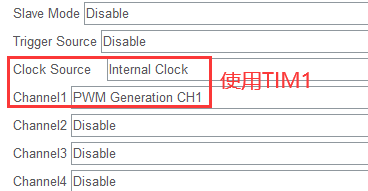
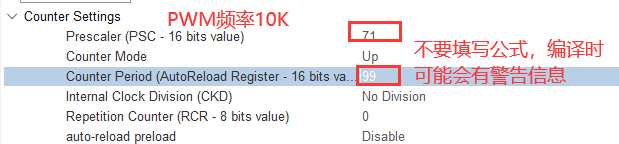

# PWM相关参数计算

- PWM频率：Freq = SYS_CLK / (PSC+1) / (ARR+1)
- PWM占空比：Duty = CCR / (ARR +1) 
- PWM分辨率：Reso = 1 / (ARR +1)，即PWM的步长

示例1：输出频率为10K的PWM。

- SYS_CLK = 72MHz，MCU工作频率
- ARR = 100 - 1，自动重载寄存器
- PSC = 72 - 1，预分频器寄存器

# 1.STM32CubeMX配置

预期功能：使用PWM控制LED，实现呼吸灯的效果。

**注意：配置定时器外设时，别忘了选择LL库。**

TIM1工作参数配置：





# 2.业务代码

初始化定时器：

```c
  LL_TIM_EnableCounter(TIM1);                        // 启用TIM1的计数器
  LL_TIM_CC_EnableChannel(TIM1, LL_TIM_CHANNEL_CH1); // 启用定时器的指定通道
  LL_TIM_EnableAllOutputs(TIM1); // 启用定时器的所有输出，经过测试，不加该语句无法输出PWM
```

输出PWM(两种方法均可)：

```c
  LL_TIM_OC_SetCompareCH1(TIM1, 50); // 使用函数输出占空比为50的PWM
  TIM1->CCR1 = 50; // 直接写寄存器的CCR值，输出PWMF
```

呼吸灯代码：

```c
  while (1)
  {
    for (uint16_t i = 0; i <= 100; i++)
    {
      LL_TIM_OC_SetCompareCH1(TIM1, i); // 输出占空比为i的PWM
      LL_mDelay(50);
    }
    for (uint16_t i = 0; i <= 100; i++)
    {
      LL_TIM_OC_SetCompareCH1(TIM1, 100 - i);
      LL_mDelay(50);
    }
    /* USER CODE END WHILE */

    /* USER CODE BEGIN 3 */
  }
```

