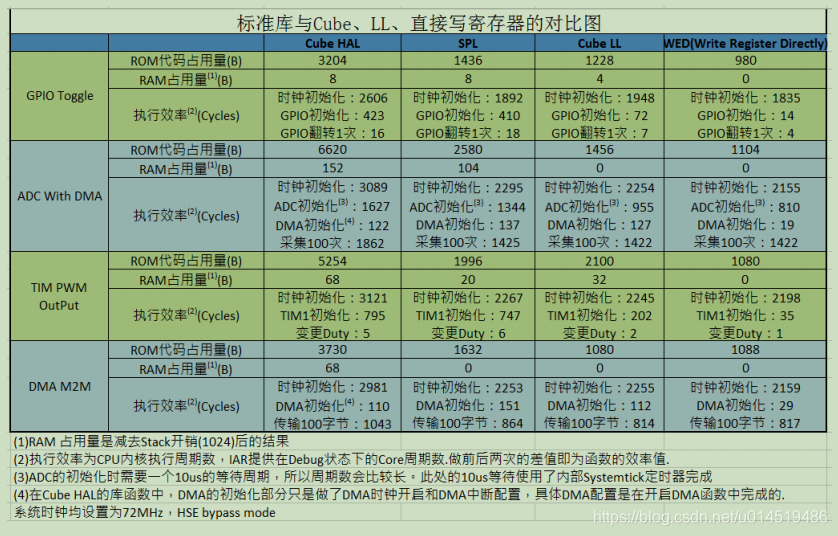

## 1. HAL库与LL库的区别

STM32系列的芯片，到目前为止共有三种开发方式：标准外设库(SPL库)、HAL库、LL库。

1. 标准库(Standard Peripheral Libraries)：与`HAL库、LL库`相互独立，互不兼容。直接访问硬件外设接口，效率较高。
2. HAL库(Hardware Abstraction Layer)：硬件抽象层。在标准库的基础上，提供了更高层次的硬件抽象。可以简化开发过程，使用户更轻松地移植代码到不同的STM32芯片上。
3. LL库(Low-Level Library)：LL库更接近硬件层，最接近于标准库开发，直接操作寄存器。**可以与HAL库混合使用，LL库的命名方式与HAL库基本相同。**

**对于ROM资源较小的MCU，推荐使用LL库进行项目开发。LL库比HAL库执行效率更高，而且占用的资源也更小。**

STM32使用寄存器、标准库、HAL库、LL库，性能对比：

**总结：相较于HAL库，LL库的效率得到了极大的提升，进似于直接读写寄存器。**

## 2. 学习进度

开发环境：STM32CubeMX、KEIL5(版本5.36.0.0)、VScode(插件Keil Assistant)        

开发工具：STM32F103C8T6开发板、DAP-Link

- [x] 2024年1月21日：使用LL库点亮LED、输出PWM
- [ ] UART串口发送功能
